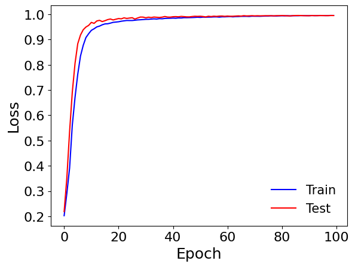
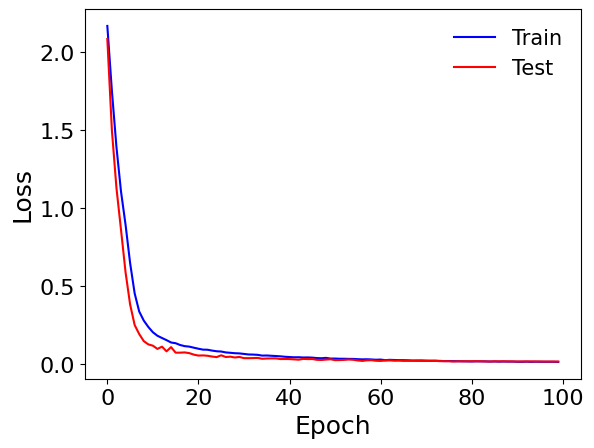
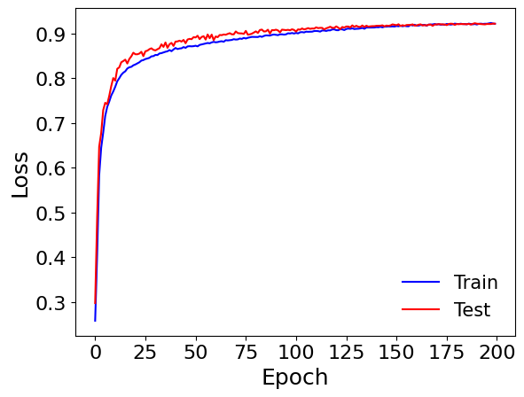
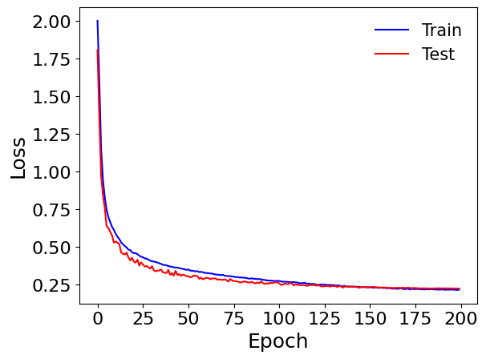
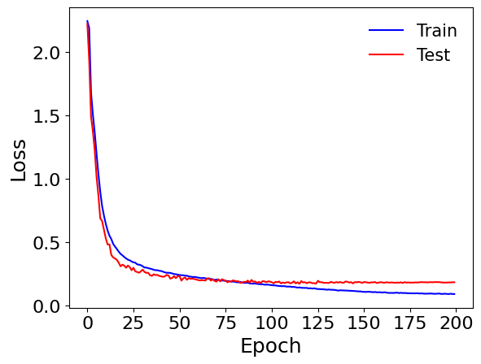
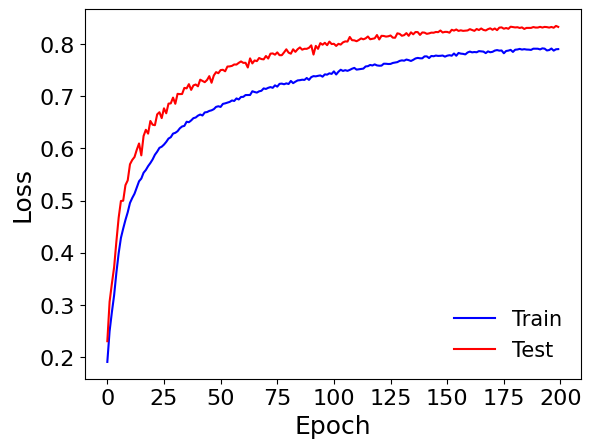
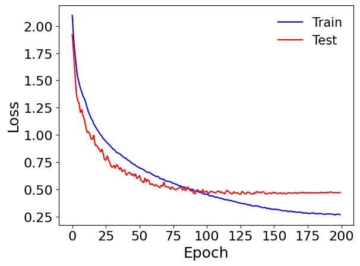

# Vision Transformer for MNIST and CIFAR-10
### Simplified Scratch Pytorch implementation of Vision Transformer (ViT) with detailed steps (Refer to <a href="model.py">model.py</a>).    

<ul>
  <li>Scaled-down version of the original ViT architecture from <a href="https://arxiv.org/pdf/2010.11929.pdf">An Image is Worth 16X16 Words</a>. </li>
  <li>Has only 210k parameters (Original ViT-Base has 86 million). </li>
  <li>Works with small datasets by using a smaller patch size of 4.</li>
  <li>Supported datasets: MNIST, FashionMNIST, SVHN, and CIFAR10.</li>
</ul>  

  

## Run commands (also available in <a href="scripts.sh">scripts.sh</a>):  
<table>
  <tr>
    <th>Dataset</th>
    <th>Run command</th>
    <th>Test Acc</th>
  </tr>
  <tr>
    <td>MNIST</td>
    <td>python main.py --dataset mnist --epochs 100</td>
    <td>99.5</td>
  </tr>
  <tr>
    <td>Fashion MNIST</td>
    <td>python main.py --dataset fmnist</td>
    <td>92.3</td>
  </tr>
  <tr>
    <td>SVHN</td>
    <td>python main.py --dataset svhn --n_channels 3 --image_size 32</td>
    <td>95.7</td>
  </tr>
  <tr>
    <td>CIFAR-10</td>
    <td>python main.py --dataset cifar10 --n_channels 3 --image_size 32</td>
    <td>82.1</td>
  </tr>
</table>
 
The default path for downloading the dataset is "./data" and can be changed using the --data_path argument.

  
## Transformer Config:

<table>
  <tr>
    <th>Config</th>
    <th>MNIST and FMNIST</th>
    <th>SVHN and CIFAR10</th>
  </tr>
  <tr>
    <td>Input Size</td>
    <td> 1 X 28 X 28   </td>
    <td> 3 X 32 X 32  </td>
  </tr>

  <tr>
    <td>Patch Size</td>
    <td>4</td>
    <td>4</td>
  </tr>
  <tr>
    <td>Sequence Length</td>
    <td>7*7 = 49</td>
    <td>8*8 = 64</td>
  </tr>
  <tr>
    <td>Embedding Size </td>
    <td>64</td>
    <td>64</td>
  </tr>
  <tr>
    <td>Num of Layers </td>
    <td>6</td>
    <td>6</td>
  </tr>
  <tr>
    <td>Num of Heads </td>
    <td>4</td>
    <td>4</td>
  </tr>
  <tr>
    <td>Forward Multiplier </td>
    <td>2</td>
    <td>2</td>
  </tr>
</table>

  
## Training Graphs:

<table>
  <tr>
    <th>Dataset</th>
    <th>Accuracy</th>
    <th>Loss</th>
  </tr>
  <tr>
    <td>MNIST</td>
    <td>  </td>
    <td> </td>
  </tr>
  <tr>
    <td>FMNIST</td>
    <td>  </td>
    <td> </td>
  </tr>
  <tr>
    <td>SVHN</td>
    <td>  </td>
    <td> </td>
  </tr>
  <tr>
    <td>CIFAR10</td>
    <td>  </td>
    <td> </td>
  </tr>
</table>
